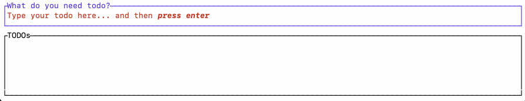
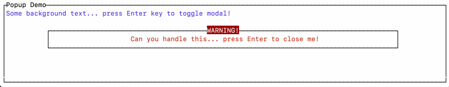

# Terminal UI for Roc (WIP)

This is a tui platform for Roc built on top of the excellent [tui-rs](https://docs.rs/tui/0.19.0/tui/).

My goal for making this platform is to learn more about Roc dev; to explore ideas for the Roc editor, and how to do [Action-State in Roc](https://docs.google.com/document/d/16qY4NGVOHu8mvInVD-ddTajZYSsFvFBvQON_hmyHGfo/edit#).

**I welcome any feedback or assistance!**

Note that to close the app it is currently hardcoded in the platform to the 'ESC' key. This will be configurable when I add support for effects. 

Here is the `hello.roc` example.

```elixir
# Model
Model : { text : Str }

init = \_ -> { text: "Hello world!" }

# Handle Events
update : Model, Event -> Model
update = \model, _ -> model

# Render UI
render : Model -> List Elem
render = \model -> 
    text = [[Elem.styled model.text { fg: Green }]]
    
    [ Elem.layout [ Elem.paragraph { text } ] {} ]
```

Here is a demonstration of `examples/todo.roc`.



and, here is a demonstration of `examples/popup.roc`.



If your feeling brave you can use a URL release of this platform. For more information how to do this see the [Roc Tutorial](https://www.roc-lang.org/tutorial#the-app-module-header).

## Things I'm working on, or thinking about
- [x] Block widget
- [x] Paragraph widget
- [x] Responsive layouts 
- [x] Styling
- [x] Scrolling for paragraphs
- [x] Optional Records for better API 
- [x] [List](https://docs.rs/tui/0.19.0/tui/widgets/struct.List.html) widget
- [x] Add support for Popup/Modals
- [ ] Support for effects (e.g. close app)  
- [ ] Support more widgets. Currently blocked on [#4554](https://github.com/roc-lang/roc/issues/4554)
  - [ ] [Canvas](https://docs.rs/tui/latest/tui/widgets/canvas/struct.Canvas.html#) widget  
  - [ ] Tabs
  - [ ] Table
  - [ ] Charts
  - [ ] Sparkline
- [ ] More examples
- [ ] Support Tasks such as opening a File similar to CLI, needs investigation. Better to wait for improved `roc glue` support and packages
- [ ] Better error handling, don't mess up terminal if Roc panics somehow
- [ ] Support for mouse input
- [ ] Write some tests

## Process to add functionality
1. Review the [tui-rs docs](https://docs.rs/tui/0.19.0/tui/) and [examples](https://github.com/fdehau/tui-rs/tree/master/examples) to understand the behaviour.
2. Add feature to the [Platform API](./platform/main.roc) `*.roc` files
3. Generate `platform/glue.rs` with `roc glue platform/main.roc platform/src/glue.rs` note the comments in `platform/main.roc`
4. Use `cargo build` from the platform folder to fix any errors
5. Wire functionality into the platform host Rust code 
6. Update `hello.roc` and other examples
7. Rebuild release with `roc build --bundle .tar.br platform/main.roc` 


